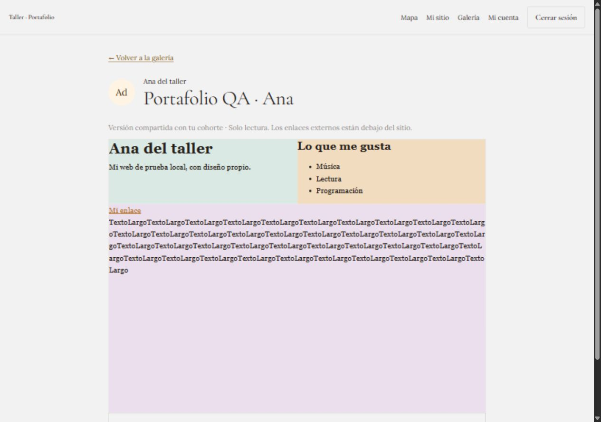
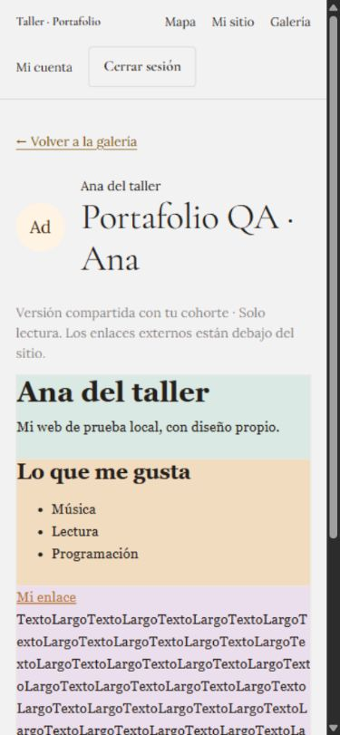
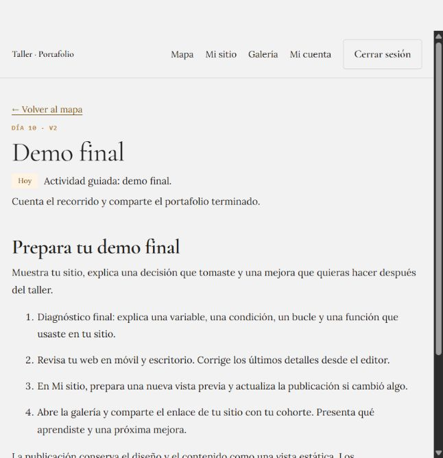

# Evidencia de QA local — 28–29 septiembre 2026

Todas las identidades y textos de estas capturas son ficticios. Se usaron las páginas reales de React y las rutas reales de FastAPI, con SQLite temporal y autenticación inyectada exclusivamente desde tests. No se leyó `.env`, no se contactó producción y no se publicó ninguna rama.

## Reproducir

1. Desde `backend`, ejecutar `.venv/Scripts/python.exe tests/browser_server.py` (en Unix, `.venv/bin/python`). Crea datos temporales y escucha solo en `127.0.0.1:8765`. Al detenerlo se cierra la base temporal.
2. Desde `frontend`, usar Node 24.15+ y ejecutar `npm ci` y `npm run dev -- --host 127.0.0.1 --port 5173 --strictPort`.
3. Abrir `http://localhost:5173/tests/browser/audit.html#/mi-sitio`. El harness está fuera del build, requiere DEV y hostname local. No requiere cuenta ni credenciales reales.
4. Preparar preview, revisar, publicar en la cohorte ficticia, visitar galería/sitio, modificar título, preparar otra preview, actualizar y recargar. Retirar la versión y comprobar que desaparece y que su URL muestra indisponibilidad.
5. Abrir `/mapa`, Ju2 y V2 mediante enlaces. Comprobar instrucciones y permisos de sesión.
6. Detener ambos procesos al terminar. No conservar los datos ficticios ni usar este servidor como entrada de despliegue.

El router del harness es HashRouter. La URL copiada por el componente es la ruta real de producción `/p/slug`; en este harness se visita mediante el enlace interno `#/p/slug`. La ruta real y el retorno después de login se prueban también montando los guards con MemoryRouter. Esto no certifica un inicio de sesión real en Firebase ni rewrites de Netlify.

## Resultados observados

| Recorrido | Resultado |
|---|---|
| Preview desde fuente guardada | Contenido seguro recibido de FastAPI; consentimiento requerido |
| Publicar y galería | Tarjeta con nombre visible, título y enlace; sitio de solo lectura |
| Actualizar | Estado «Cambios sin publicar» antes de confirmar; revisión 1→2; mismo slug |
| F5 | Revisión 2 y título persisten en el servidor temporal |
| Copiar | Mensaje de enlace copiado; fallback de selección cubierto por prueba UI |
| Retirar | Galería vacía y URL anterior con error controlado 404 |
| Ju2/V2 | Guías accesibles desde mapa, coherentes con privacidad y snapshot estática |
| 1280×900 | Dos columnas de ~401 px y celda inferior combinada de ~802 px |
| 390×844 | Una columna; ancho de scroll y contenedor ~338 px, incluso con texto largo sin espacios |
| Sandbox publicado | `allow-scripts` sin same-origin; CSP `script-src 'none'`, sin recursos remotos |

El QA encontró un fallo que jsdom no reproducía: Chromium compacta gridRow/gridColumn como grid-area. El sanitizador descartaba la geometría de las secciones. Se reprodujo con tres casos reales, se corrigió con gramática numérica acotada y se añadieron cuatro casos maliciosos. Se repitió el recorrido y las mediciones después de corregirlo.

Las recargas causadas por crear copias temporales de mutación dentro del árbol observado por Vite se excluyeron de la prueba final; se completó el recorrido con los mutantes retirados. El servidor y el navegador de pruebas quedaron cerrados.

## Capturas

`critical-mutations.json` registra seis mutaciones adicionales con control verde y fallo de aserción al retirar la protección. Se ejecutaron en copias temporales y se restauraron. La matriz completa de 21 mutaciones está en el informe final.
