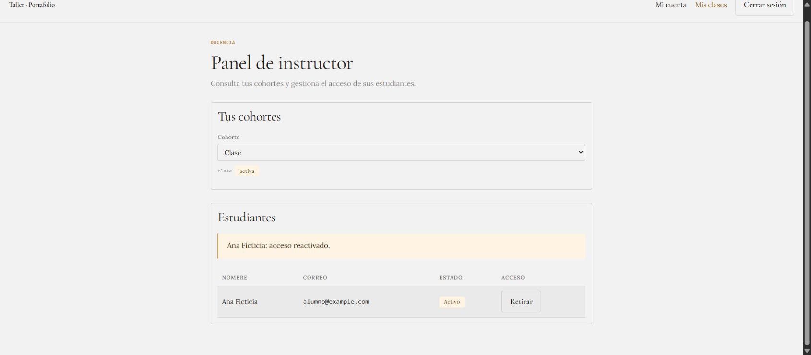

# QA local del release — 29 septiembre 2026

Datos exclusivamente ficticios. Backend FastAPI real con SQLite temporal, verificador de identidad de pruebas y bind `127.0.0.1:8765`. El harness nunca conecta a producción.

## Cómo reproducir

1. Ejecutar `backend/tests/browser_server.py` con el Python del venv.
2. Arrancar Vite con Node 24: `node node_modules/vite/bin/vite.js --config tests/browser/vite.audit.config.ts` desde `frontend/`. Esa configuración sustituye solo `firebase/auth` por el fixture local; AuthProvider, ApiClient, React Query, router y pantallas son los reales.
3. Abrir `http://localhost:5173/login` (el backend de QA solo acepta ese origen). Identidades ficticias del fixture: `alumno@example.com` (A), `otro@example.com` (B), `inst@example.com` (docente), `admin@example.com`; contraseña `qa-local`.
4. Panel de membresías en harness aislado: `http://localhost:5173/tests/browser/audit.html?staff=1#/instructor`.

El harness está fuera de la entrada del build, exige DEV y hostname local. La revisión de dist no encontró su título ni la identidad del harness.

## Recorrido A → B → A (navegador real)

| Paso | Resultado |
| --- | --- |
| A edita E13, «guardado», servidor con la marca de A | PASS |
| F5 | PASS: el borrador vuelve |
| Editar y salir de inmediato por el mapa | PASS: el flush guarda antes de navegar |
| Cambiar de día (Mi1/E4) y volver a Ju1/E13 | PASS |
| A publica v1 para su cohorte y vuelve a editar | PASS: «Cambios sin publicar» |
| A escribe y se cambia a B **antes** de la pausa del autoguardado | PASS: nada se envía con la sesión de B; la copia pendiente queda bajo el uid de A |
| B: avatar, `datos.js`, E1, E13, Mi sitio | PASS: solo datos de B; sin aceptado, fuentes ni publicación de A |
| B: galería y sitio publicado de A | PASS: solo lo publicado deliberadamente (v1, sin scripts, sin cambios sin publicar, sin correo) |
| B sale: modelos de Monaco y almacenamiento | PASS: 0 modelos; ninguna clave de B |
| A vuelve | PASS: la edición en vuelo se recupera y se sube como A; publicación y «cambios sin publicar» intactos |
| E1 aceptado + edición pendiente al cambiar de cuenta | PASS: al volver se sube y sigue `accepted` |
| `ve:perfil` heredado sin propietario con B | PASS: no se importa; perfil de B intacto |

## Membresías (app real, cuenta docente ficticia)

Retirar a Ana (con progreso y publicación) → mapa, progreso y galería 403; un código de clase válido NO reactiva (403); su publicación desaparece de la galería de B. Reactivar → mapa 200, progreso y aceptado intactos, publicación visible otra vez. Auditoría: `REMOVE_STUDENT`, `REACTIVATE_STUDENT`.

## Consistencia visual

Ma1 (E1–E3), Mi1 (E4–E6), Ju1 (E12, E13), V1 (E7, E8), L2 (E9), Ma2 (E10), Mi2 (E11), Ju2 y V2 en 1440×900 y 375×812: mismo encabezado, navegación, editor, vista previa y revisión; 0 px de desbordamiento horizontal del documento en todas las pantallas (mapa, Mi sitio, galería y sitio publicado incluidos). Cosmético preexistente: el título de la pestaña conserva «Preparando tu cuenta» tras la carga inicial.

## Capturas

Las suites globales y limitaciones constan en [RELEASE_2026-09-29.md](../../RELEASE_2026-09-29.md).
